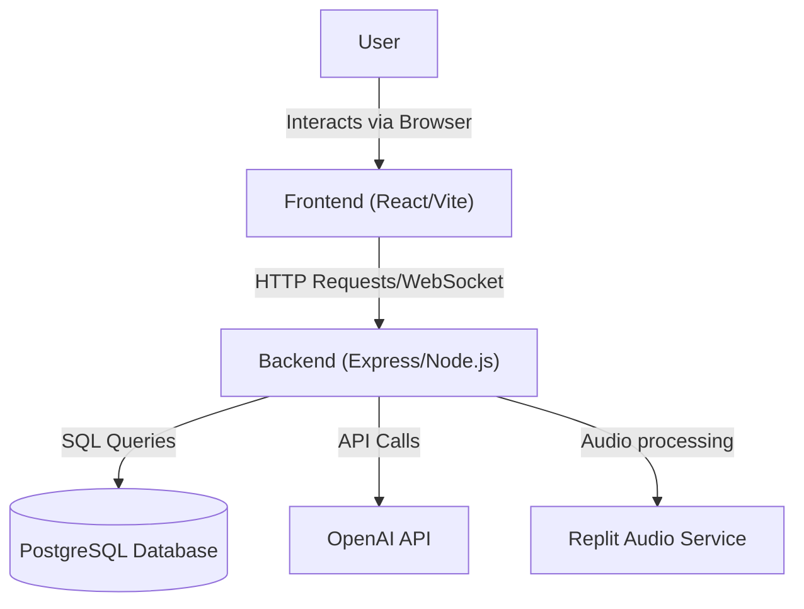

## Language Learning Adventure

### How to get running (local development)

Create a branch off of `main`, then follow the steps below.

## App Summary
Language Learning Adventure is a gamified language learning platform designed to make vocabulary acquisition and reading practice engaging and interactive. The application targets language learners who want to supplement their studies with daily challenges, reading comprehension exercises, and an immersive text-based adventure game. Users can track their progress through daily streaks, learn new words with flashcards, and practice reading with level-appropriate passages. The product uniquely combines traditional learning tools with AI-driven voice interaction in its Adventure mode to simulate real-world language usage.

## Ears Requirements

### Ubiquitous Requirements:
The system shall track user progress across lessons and activities.

### Event-Driven Requirements:
When a word is typed out the computer shall read the word out and bring up the definition
When a word is searched, the recommendation algorithm shall add it to its dictionary of words the user struggled with. 

### State-Driven Requirements:
While reading speed remains below a certain level, the recommendation algorithm shall recommend low level texts.

## Tech Stack
- **Frontend**: React, Vite, Tailwind CSS, Shadcn UI, Framer Motion, React Query, Wouter
- **Backend**: Node.js, Express, Passport.js (Authentication)
- **Database**: PostgreSQL, Drizzle ORM
- **External Services**: OpenAI API (Content Generation), Replit Audio (Voice/Audio Processing)

## Architecture Diagram


## Prerequisites
Before you begin, ensure you have the following installed:
- **Node.js**: v18 or higher

Verify your installation:
```bash
node -v
```

## Installation and Setup

1.  **Install root dependencies**  
    From the project root:
    ```bash
    npm install
    ```

## Running the Application (development)

Backend and frontend run as separate dev servers:

1.  **Start the application**  
    From the project root (SCRUM-3-1-7):
    ```bash
    npm run dev
    ```

2.  **Access the application**  
    - Open your browser and navigate to `http://localhost:5001`.

## Verifying the Vertical Slice: Mark as Mastered

To verify the complete vertical slice (frontend button → backend update → database change → UI refresh), follow these steps:

1.  **Launch the App**: Open the application in your browser at [http://localhost:5001](http://localhost:5001).

2.  **Navigate to Daily Vocab**: Click on the "Vocabulary" page in the navigation. You should see a list of words with their definitions (e.g., "application", "work", "employee").

3.  **Expand a Word Card**: Click on any word card to expand it and view the full definition, pronunciation, and usage statistics.

4.  **Mark as Mastered**: Click the "Mark as Mastered" button inside the expanded word card. You should see:
    - The button change to show "✓ Mastered" with a green background
    - The status in the card header changes from "Status: new" to "✓ Mastered"
    - The word card icon changes to a checkmark

5.  **Verify Data Refresh**: After clicking "Mark as Mastered", the page automatically refreshes the data. Scroll up to see the stats header update with an incremented "MASTERED" count.

6.  **Verify Persistence on Page Refresh**: 
    - Refresh the browser (F5 or Cmd+R)
    - Navigate back to the Vocabulary page
    - The word should still show as "✓ Mastered", proving the change persisted in the database

7.  **Database Inspection (Optional)**:
    - Connect to the database using your preferred PostgreSQL client
    - Run the following query to see all word progress records:
      ```sql
      SELECT user_id, word_id, status, times_seen, last_seen_at 
      FROM user_word_progress 
      WHERE user_id = 1;
      ```
    - Verify that the word you marked as mastered shows `status = 'mastered'` and `times_seen = 1` with a recent `last_seen_at` timestamp.

### What This Vertical Slice Demonstrates

- **Frontend**: React component with React Query mutation handling user interaction
- **Backend**: Express route that accepts PATCH request and updates database
- **Database**: PostgreSQL table (`user_word_progress`) stores and persists the changes
- **Data Flow**: User click → API request → Database update → Query invalidation → UI re-render → Persistence on refresh
